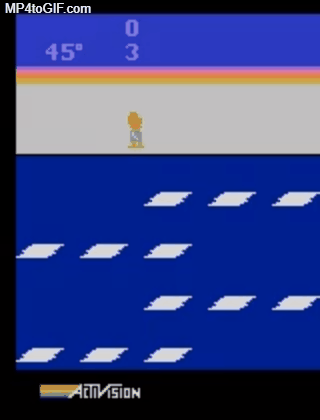

# Practical Reinforcement Learning Schedules
RL Study schedules. It includes plans, studies, projects, assignments

## 0403
금일도 어김없이 스터디가 있는 날입니다.  

지난번 예고했듯이 PG 계열의 첫걸음인 REINFORCE 코드 구현 실습합니다
노트북들고오면 더욱더 좋겠죠? 직접해보면서 결과 보면 재미가 쏟구쳐요!!
시간남는다면(아마 경험상 안남지 않을까) 어제 공유했던 논문 간략한 소개와 
책 쓰는것에 대한 얘기도 같이할까합니다. 그리고 지난 시간 논문 리뷰자료는 
깃헙에 금일중으로 올리겠습니다

12시까지 투표해주세요 감사합니다.

----

공지합니다.

1. 책 출간 
여럿차례 걸쳐서 말씀드려서 이제 다 아시다시피,
올해 저희 스터디에서 책을 2권 출간할 예정입니다. 
저자는 아래처럼 가고요, 집필계획서에 저자정보부터 
첨부의 9번 항목 채워서 먼저 보내주시고 그리고 나머지 
부분도 작성 여유되시는 분 작성해서 공유해주시면 감사하겠습니다 
이동석/윤일주님하고 지난주 간단하게 얘기는 했고 그 기준으로
내용을 채우고 있겠습니다.

기본편 - 윤일주  (조태현) 이현제 박수영 이동석  조억 (5명)
실전편 - 이동석 윤일주 이현제 허재영 조억 (5명)
미정 - 김재구 김주철

2. 실습소스 공유
어제 REINFORCE 소스 올립니다. 참고하세요, 

https://github.com/practical-rl-study/sources/blob/master/ukjo/190403_REINFORCE.py

## 0327
안녕하세요 오늘도 스터디있는 날입니다. 

금일은 
1. 스타크래프트와 강화학습 (윤일주님)
2. Policy Gradient Methods for Reinforcement Learning with Function Approximation (조억님)

2번은 내용이 많이 어려운듯하여 안오신분까지 고려해서 한번 더 리뷰할 생각입니다. 
많은 참석 부탁드리며 12시까지 답변 주시기 바랍니다.

## 0319
간만에 공지하는데 느낌이 이상하네요ㅎ 지난 수요일 못오신분들 많아 아쉬웠지만 즐거웠습니다. 스터디는 제가 눈이 이상해지기전까지 DRQN 논문을 봤었죠, 이제 Policy gradint 계열의 서막을 알리는 논문인 "Policy Gradient Methods for Reinforcement Learning with Function Approximation"에 대해서 다루겠습니다. 내일 오후 12시까지 참석투표해주세요

https://github.com/practical-rl-study/materials 에 5번에 논문 정보있습니다.

## 1128
안녕하세요~ 오늘은 스터디있는날 입니다. 
실습 2가지로 진행됩니다.

1. Frosbite 게임에다가 DRQN 적용해서 돌아가는걸 해볼 예정이며, 논문에도 1만 에피소드 이상이 걸리기때문에 결과는 따로 확인해야 할 것 같구요.
2. DQN도 Dueling, Double 적용한것 질문받고 안되는 부분 같이 살펴볼 예정입니다.

12시까지 알려주세요~~

## 1121
복귀하신 박수영님 환영합니다!! 이번에는 DRQN을 가지고 했습니다. 아타리게임 2600 [28] [Frostbite](https://www.youtube.com/watch?v=dl1jGOu5No0) 이 어려운 게임을 이기는 DQN의 variant를 살펴보았습니다. 

double & dueling dqn 구현을 저희가 만든 dqn에 넣어보는것 
파라메터를 다양하게 줘서 모든 조합을 한번에 돌리는 로직 실습했습니다.
이부분도 최대한 코드 설명한 버젼에서 보완해서 돌아가는 코드로 올리도록 하겠습니다~ 

## 1114
석정님이 Dueling DQN(Dueling Network Architectures for Deep Reinforcement Learning, Z. Wang et al., arXiv, 2015) 논문 리뷰해주셨습니다. 관련 문서도 materials에 올렸으니 참조바랍니다. 또한 빠른 속도를 위해 appendix에 있는 Double DQN에 대해서도 다루었습니다.  다음시간은 코드 구현을 직접해보면서 간단히 DQN에 적용해보도록 하겠습니다.

## 1107
오늘 스터디는 DQN을 맨땅부터 코딩해서 완전히 이해하고 마무리하는 시간을 가질게요. 각자 노트북 지참하면 좋겠죠? 12시까지 알려주세요!!

## 1031
참석 인원 3명으로 쉬어감

## 1024
DQN 논문 2015년 버젼(Human-level control through deep reinforcement learning, V. Mnih et al., Nature, 2015.)  리뷰

## 1017
### Before
다들 주말에 아이디어 생각을 좀 해보셨는지요? ^^
 
1. 금주안에 새로운 주제 선정할거구요,  금주 수욜 아이디어 나온것 가지고 불참 회원들도 온라인 voting할 수 있게 할게요  https://goo.gl/bW1j1K

2. 저조한 참석율로 멤버증원의 차원으로 신규 멤버 소식이 있습니다. 송석정님이고 경희대 박사과정 밟고 모두연 강화학습 DLC반입니다.   현재 저 포함 12명인데요, 15명정도면.. 그래도 최소 매주 5명 정도는 모이지 않을까해서요 30%이상만 모이면 되니까요.  주변에 꾸준히 나올 멤버 있으면 언제든 알려주세요. 꾸준함이 살길입니다^^

그럼 금주 수요일은 왠만하면 다들 나오셔서 같이 간만에 안부도 묻고 좋은 시간 가졌으면 좋겠습니다.

### After
오늘 간만에 뵙는 주철님과 그리고 새로오신 석정님, 그리고 늘 꾸준히 참석해주시는 동석님 그리고 재영님 이렇게 4분과 스터디 진행 방향에 대해서 얘기를 시간 가는줄 모르고 나눈 것 같습니다. 우선 석정/재영님은 강화학습을 생각하고 들어오셨고 나머지분들도 강화학습을 메인으로 하는게 맞다라는 얘기였고요, 
의도된바는 아닌데 살짝 회고 하는 시간을 가져봤구요.  여튼 진행하면서 놓친 부분 더 잘 할수 있는 많은 부분을 피부로 느낄수 있었고요, 

정리하자면, 
1. 우선 RL이다.
2. 이론만 아는것보다는 구현에 대해서 실력이 쌓였으면 좋겠다.
3. 논문을 쓸 뗄깜으로 주제를 잡아갔으면 좋겠다.
4. 스터디를 함에 있어서 휘발성이 아니라 쌓여가는 게 있었으면 좋겠다.
5. 공모전 같은데 나가봤으면 좋겠다 (이건 지난주 참석했던 멤버들과 얘기도 같이 겸해서)
6. 동석님 의견인데 짧게 치고 나가는게 있었으면 좋겠다.

이런 의견들을 적극 모두모두 반영해서, 방향은 강화학습의 root 뿌리가 되는 중요 알고리즘 논문과 그 variants(변종)들중 유명한것들만 해서 top 10개를 list up해서 구현 해보는걸 해보기로 했습니다. git repository를 관리할거고 그리고 논문 리뷰는 쉽게 정리해서 공유하고 그리고 구현을 한번씩 해보는걸로 해보는거죠. 논문에 대한 두려움은 없으셔도 됩니다. 저와 석정님이 support를 할거고요. 구현 쪽을 엔지니어분들은 좀 이참에 아이디어를 어떻게 녹일지를 고민해보면서 2018년도 올해 내내 배운것들을 다시 다지는 시간을 가지면 좋겠습니다. 10개 잘 따라오시면 충분히 가능합니다.  

마지막으로, 제가 스터디 주제도 너무 광범위하게 가져간것도 조금 잘못했나 싶기도 하고 먼저 얘기해보고 그다음에 준비된 주제를 공유드린것도 좋지 않았을까 생각이 들었네요. 참. 회비가 앵꼬네요. -30이나.. 한번 걷겠습니다. =-=

## 1010
강화학습 기초부터 value based의 알고리즘 DQN부터 policy based 알고리즘 REINFORCE 그리고 A3C까지 다루었습니다. 
재구님과 경일님과 함께 여태까지의 스터디 히스토리와 그리고 아이디어 회의를 하였습니다.

아래는 아이디어 안들입니다.
https://goo.gl/bW1j1K

## 0918
오늘 스터디 있는날입니다!! 7시반이구요! 보시고 바로 답주세요~ 늦어도 12시까지 답주셔야되요! 지난 시간 빠르게 PG 모델인 REINFORCE훑고 바로 A3C 코드까지 살펴보고 얼마나 빨라지는지 느끼셨을거라 생각됩니다. 이번엔 A3C를 pytorch로 짜보는 실습을 해보는걸로 할까합니다. 직접 한줄한줄 짜볼려고 합니다. 그리고 제가 회사에서 진행중인 스타크래프트 강화학습 모델을 한번 설명드리고 강화학습 적용할 때의 당면했던 문제/트러블슈팅도 설명드릴려고 합니다.

## 0912
1. 지난 시간에 PG 모델인 REINFORCE를 짜보는 실습을 PYTORCH와 Keras로 진행했습니다. 아래는 소스코드이구요, 슬랙에 plot도 공유했었죠?
https://gitlab.com/iljoo.yoon/rl-study/blob/master/src/study/180808_reinforce_using_pytorch.py
https://gitlab.com/iljoo.yoon/rl-study/blob/master/src/study/180808_reinforce_using_keras.py
그때 온 분들이 적어서 다시 한번 살짝 다루고요

2. A3C Cartpole 코드를 살펴보는 시간을 가지겠습니다. 얼마나 빨라지는지 보시길 ^^ 그 다음에는 이걸 직접 짜보는 pytorch로 실습을 해보는걸로 하곘습니다.

3. 지지난주부터 공지했던 재미난 실습을 시작해볼려고 합니다. 욕심안내고 그냥 파이선으로 네이버에 있는 종목게시판 제목을 쭉 긁어와서 파일로 저장하는 데이터 수집만 먼저 다루겠습니다.

## 0905
오늘 스터디 있는날입니다. 7시반이구요, 보시고 바로 답주세요~ 늦어도 11시까지 말씀해주세요, 참 AI Forum 오시는분 있으신가요?

1. 지난 시간에 PG 모델인 REINFORCE를 짜보는 실습을 PYTORCH와 Keras로 진행했습니다. 아래는 소스코드이구요, 슬랙에 plot도 공유했었죠?
https://gitlab.com/iljoo.yoon/rl-study/blob/master/src/study/180808_reinforce_using_pytorch.py
https://gitlab.com/iljoo.yoon/rl-study/blob/master/src/study/180808_reinforce_using_keras.py
그때 온 분들이 적어서 다시 한번 살짝 다루고요

2. A3C Cartpole 코드를 살펴보는 시간을 가지겠습니다. 얼마나 빨라지는지 보시길 ^^ 그 다음에는 이걸 직접 짜보는 pytorch로 실습을 해보는걸로 하곘습니다.

3. 지지난주부터 공지했던 재미난 실습을 시작해볼려고 합니다. 욕심안내고 그냥 파이선으로 네이버에 있는 종목게시판 제목을 쭉 긁어와서 파일로 저장하는 데이터 수집만 먼저 다루겠습니다.

오늘 저번에 합류해서 인사했던 김경일님도 오실수 있음 좋겠네요~
제주도에 있는 동석님 오늘 저녁뱅기인데 오실수 있음 오시고, 참석가능하신분 12시까지 말씀해주세요,
아 그리고 오늘 스터디는 7시반이 아니라, 8시에 하겠습니다.

## 0824
제가 차주 수요일까지 학회 논문 제출이라 여유가 없어서 멤버분들에게 죄송하네요. 이번 포함하면 스터디 3주째 쉬고 있습니다. 차주도 논문 일정에 따라 한주 더 쉬어갈지도 모릅니다. 여튼 폭염/휴가철도 갔으니 본격적으로 재가동할 예정이에요~^^ 다시 새로운 멤버 2분(한분 더 올지도) 와서 재미있게 진행토록 하겠습니다. 스터디 운영을 어떻게 했으면 좋겠다 라는 의견도 주시면 좋을 것 같네요.

## 0822
날씨가 많이 선선해져서 살맛나는 요즘이네요, 오늘도 스터디 있는날입니다^^   
1. 지난 시간에 PG 모델인 REINFORCE를 짜보는 실습을 PYTORCH와 Keras로 진행했습니다. 아래는 소스코드이구요, 슬랙에 plot도 공유했었죠?
https://gitlab.com/iljoo.yoon/rl-study/blob/master/src/study/180808_reinforce_using_pytorch.py
https://gitlab.com/iljoo.yoon/rl-study/blob/master/src/study/180808_reinforce_using_keras.py
그때 온 분들이 적어서 다시 한번 살짝 다루고요

2. A3C Cartpole 코드를 살펴보는 시간을 가지겠스빈다. 그 다음에는 이걸 직접 짜보는  pytorch로 실습을 해보는걸로 하곘습니다.
3. 지지난주부터 공지했던 재미난 실습을 시작해볼려고 합니다.  
욕심안내고 그냥 파이선으로 네이버에 있는 종목게시판 제목을 쭉 긁어와서 파일로 저장하는 데이터 수집만 먼저 다루겠습니다.

오늘 저번에 합류해서 인사했던 김경일님도 오실수 있음 좋겠네요~
완준님에 이어 말레시시아를 가는 태현님 빼고 참석가능하신분 12시까지 말씀해주세요,
아 그리고 오늘 스터디는 7시반이 아니라, 8시에 하겠습니다. 

## 0814

- 김경일님 합류

공지 드립니다
1. 내일은 광복절이라 하루 쉬어갑니다. 일정 조율에 차질 없으시길 바랍니다.
2. 공지사항 하나더!! 멤버 한명이 충원됩니다. 이동석님과 같이 회사 동기인데요, 김경일님이라고..
강화학습부터 딥러닝까지 더 늦기전에 배워야겠다고 합류 꼭 하고 싶다고 합니다^^ 이분은  회사에서 제가 하는 스타크래프트에 강화학습 적용도 했었어요~ Q 테이블 써서 하는 Q Learning 가지고 말이죠. 밑바닥책과 DQN정도는 다 공부하고 넘어오셔서 저희 진도 맞추기에도 문제 없을듯합니다. 김경일님은 와서 강화학습 컴피티션도 나가보자고 제의를 먼저 하시네요~
3. 참 지난번에 못했던 재미난 실습을 먼저 할려고 합니다.  네이버 주식 종목게시판에 제목 크롤링해서 감성분석해서 RNN분석하는거 해보는거 재구님외에 지원자 없나요?

재구님하고 동석님 다른 부분 하고 싶으심 말씀해주세요 !!

차주에 있을 실습입니다. @김재구님  @이동석님 follow up 잘 부탁드립니다 ㅋㅋ

주제 : 네이버 뉴스 종목게시판이 글 제목 읽어와서 일별 변수로 정의하고 RNN 이용한 주가 가격 트렌드 예측할려고 합니다.

예1) 얼마나 곡소리가 나와야 저점을 다지고 다시 오르는가를 알아보자는 등..

1) 제목 크롤링하는것 (조억 : 재구님이 잘하시겠으나, 텍스트마이닝 패캠에서 들으셨으니 리마인드차원에서 피처 뽑는걸 하시지요!!)
https://finance.naver.com/item/board.nhn?code=015760

2) 형태소 분석 및 감정 이외에 특징을 뽑아낼것 키워드 리스트업 (김재구님)
아래는 그냥 꼬꼬마랑 감성분석 플러그인 링크인데요 어떤것이어도 좋습니다.
@조태현님이 아이디어좀 주시는것도^^  사실 제일 중요한 단계라고 생각됩니다.
  http://kkma.snu.ac.kr/documents/
  https://github.com/mrlee23/KoreanSentimentAnalyzer

3) 일별 피처 생성을 위한 전처리 (이동석님)

4) 시점별 피쳐 RNN 모델 디자인 및 개발  (조억)

5) 모델 검증 및 향후 적용 아이디어 브레인스토밍 (조억)

## 0808
휴가철/폭염때문에 4주째 쉬고 있네요. 저희 스터디 있는날입니다. 가능하신 분들은 12시까지 답을 주세요. Policy Gradeint 계열의 강화학습의 알고리즘 중 첫 관문인 REINFORCE를 짜보는 실습을 진행할 예정입니다. 그것도 재구님이 추천한 PYTORCH로.. 저도 공부해가면서 할거라.. 이거 하나만 욕심안내고 할 생각입니다. 그리고 어제 제안한 건, 재구님외에 지원자 없나요? 이걸 위해 크롤링하고 감성분석하고 RNN이 필요한데요, 우선그중 하나인 rnn을 다룰 예정입니다. 제안한 실습은 다음주에 지원자 한명 더 모집되면 차주에 진행하겠습니다!

## 0801
휴가철이기도 하지만 스터디가 폭염때문에 뜨문뜨문하네요~ 하지만!! 스터디 오늘 있는날입니다. 가능하신 분들은 12시까지 답을 주세요. Policy Gradeint 계열의 강화학습의 알고리즘을 하나씩 짜보는 실습을 진행할 예정이고, RNN도 다룰 예정입니다. (이건 CNN보다 재미나요~~ 제 생각에 RNN은 아직 갈길이 멀지만 흥미로운 주제입니다 ㅋ) 뭐 어느 회원님 말씀처럼 휴가기간이니 연달아 쉬는것도 재충전시간이라 생각하며 건너 뛰는것도? 하지만... 진행합니다. 다수결로~^^

## 0725
찌는 폭염의 연속이네요ㅜㅜ 에어컨을 맨날 풀가동하다 한국전력 주식을 3일전에 살까 와이프에게 얘기했더니 진짜  그뒤로 계속 오르는중이네요~ 오늘 강화학습 스터디 있는 날입니다. 지난 시간에 A3C 까지 이론을 다뤘던 것 복습 간단히 하고 실습 단계로 넘어갑니다. REINFORCE부터 한번 보시죠~노트북 들고 오시면 될것같습니다. 휴가간 분들이 많아서 오늘 스터디 스킵해도 좋은날이었으면 하는 바램은 있으나 그래도 꾸준히 가시죠^^

## 0718
지난 한주 잘 쉬셨나요? 금일은 스터디있는 날입니다~^^
실용적으로 스터디를 추구하고자 매주 하나씩 실습해보는 시간을 가질겁니다.
쉬운 코드라 바로 그날 하나씩 완료할거고 그걸 github에도 각자 push 할까 합니다.(노트북가져오시면 좋겠죠?)
처음으로, CNN 모델 간단히 설명드리고, 모델 하나 만들어서 간단한 이미지 분류해보는것부터 하지요!
부담안가는선에서 코딩으로 완전한 배움으로 가는 과정으로 갈수 있게끔^^

이건 전의 공지내용 복붙..
지지난주 REINFORCE까지 했고 A3C 합니다. 잠깐 복습하고 A3C,A2C 나갑니다. 오늘 아마 Policy Gradient이론 슬라이드는 끝낼낼거 같네요. value based 강화학습 DQN까지는 실습을 조금 자율에 맡기고 제가 설명만 간단히 드리고 넘어갔는데 조금 자세히 다루면서 갑니다.  불참하시는 분만!!! 12시까지 참석여부 알려주시고요

## 0711
금일도 스터디있는 날입니다~^^ 지난주에 REINFORCE까지 했고 A3C 합니다. 잠깐 복습하고 A3C,A2C 나갑니다. 오늘 아마 Policy Gradient이론 슬라이드는 끝낼낼거 같네요. value based 강화학습 DQN까지는 실습을 조금 자율에 맡기고 제가 설명만 간단히 드리고 넘어갔는데 조금 자세히 다루면서 갑니다.  불참하시는 분만!!! 12시까지 참석여부 알려주시고요, 태현님은 예비군인거 알고 있으니 답변 안주셔도 됩니다.

## 0704
스터디 멤버 여러분 굳모닝입니다. 오늘 하늘 보셨나요? 정말 기가 막히네요 아까 출근길 찍은건데요! 날씨는 덥고 습해서 동남아날씨같지만 좋은 하루 보내길 바라겠습니다. 그리고 공지 ㅋㅋㅋ 오늘도 어김없이 스터디있는 날입니다. 지난시간에는 Policy Gradient 개념부터 PG Theorem 거쳐 Policy Graident의 시작인 REINFORCE까지 다루었습니다. 다시한번 복습하고 Actor Critic 계열 알고리즘 설명 들어가겠습니다. 그리고 원하시는 분이 있다면 증명을 하다가 중간에 stop했는데 논문이나 Richard Sutton책 열어놓고 PG Theorem 증명을 다루겠습니다. 그럼 12시까지 참석 여부 알려주세요, 있다가 뵙겠습니다!!~~

## 0627
오늘 우리 스터디있는 날입니다. Policy Graident 서론 얘기하면서 REINFORCE부터 Actor Critic 알고리즘을 아주 얄팍하게 다뤘는데 다시 한번 복습하구요 바로 REINFORCE를 심층적으로 다뤄볼려고 합니다. 12시까지 참석 여부 알려주세요, 있다가 뵙겠습니다!!

## 0620
안녕하세요 스터디 방학 잘 보내셨나요? 2주가 꽤 길게 느껴지네요~ 오늘 스터디날이며 주제는 드디어!! Policy Gradient 나가도록 하겠습니다.  오늘부터 자료는 다 공유를 드려서 출력을 하든가 할수 있도록 하겠습니다. DQN까지 잘 했다면 PG도 결코 어렵지 않을것 같구요, DQN처럼 오래 다룰 생각은 없고요 이거 끝나면 강화학습 배운 모델가지고 실습을 이것저것 하면서 손에 익히는 시간을 많이 가져가면 좋겠 다 생각이 들었습니다. 그리고 간단한 AE, GAN, LSTM, RNN, CNN등 딥러닝 모델도 간단히 Keras로 보는 시간도 가져보고 좀 이론말고 어플리케이션 측면을 강조해나갈까 합니다 ^^ PG가 어느정도 되고 나고 시간이 남는다면 Trading Gym과 Agent를 소개를 할려고 합니다. 이따 뵙겠습니다.  11시까지 참석여부 알려주시고요~ 간만에 뵈요!!

## 0606
모두의 연구소 멤버들 코딩캐프일정으로 스터디 한주 쉽니다.

## 0530
시간이 빠르네요~ 어제 태현님이 저보고 오늘 스터디하냐고 묻길래, 한다고 했더니 씨익 웃더라구요. 그래서 왜 그러냐니 좋아서요 라고 하더라구요. 진심인지 몰겠습니다. 여튼 그걸 확인하기위해서라도 ㅋ 오늘 스터디 진행합니다.  11시까지 알려주세요!! 
### 지난 시간
에는 DQN 까지의 이론을 새로 오신 김재구님 까지해서 한번 가볍게 언급하고 실습 버젼으로 DQN까지는 다루었습니다. 오늘은 그 업그레이드 버젼에 대한 이론을 근간하는 코드를 보이면서 구현까지 내용을 마무리 하고, 
### 오늘은 
드디어 Policy graident로 처음이니 쉽게 다룰 예정입니다. 오늘 참석이 어려우신 분은 오전11시까지 알려주시구요, 지난시간에 3분이 갑자기 급 못오셔서 공간비를 그대로 냈답니다. 물론 일때문이니 어쩔수 없지요 ^^ 
#### 차주 
쉽니다. 참고로 차주에 저, 태현님, 완준님은 모두의 연구소에서 단타 에이전트 봇 만들러 세부로 코딩캠프를 떠납니다. 그래서 스터디 한주 쉽니다. 다녀오면 아마 주식 단타치는 에이전트 돌아가는거 소개하는 시간을 따로 만들게요

## 0523
김재구님 합류
오늘 스터디는 진행합니다. 저번에 DQN 까지의 이론을 다루었는데 이론을 다시 한번 새로 오실 김재구님을 위해 한번 가볍게 언급하고 DQN과 DQN 업그레이드 버젼에 대한 구현 파트 쪽 설명으로 넘어가겠습니다.. 오늘이 정말 마지막으로 DQN끝으로 하고 Policy graident로 넘어가기 마지막입니다. 오늘 참석이 어려우신 분은 오후1시까지 알려주시구요, 재구님은 오늘 모임 장소는 신논현에 M2 Space라고 교보타워 뒷편에 있는쪽으로 7시반까지 와주시면 됩니다.

그리고 제 아들은 의사 말로는 이제 최악은 지났다고 하네요~ 살면서 이렇게 마음이 아팠던적이 또 있었을까 싶습니다 ㅋ 우리 김주철님 작년에 맘고생하셨던거에 비하면 새발의 피겠지만요 말도 못하는 20개월 애기한테 혈관을 못찾아서 2시간 넘게 혈관을 쑤시는데 맴찢입니다 ㅜㅜ 회복하는데 좀 더 걸리겠지만 한숨 돌렸네요. 대신 와이프가 짐 그 바통을 이어 받아서 또 멘붕이지만 좋아지겠죠~ 다들 걱정해주셔서 감사합니다~

## 0518
동근당님, 이동석님, 윤병도님, 김주철님 빼면 6분 참석하시는걸로 알고 내일 10시에 컴퓨터 앞에 대기 부탁드리겠습니다. 스터디 내용은 영상 따로 녹화떠서 불참하신분들 볼 수 있도록 하겠습니다. 그리고 아까 말씀드린 투표 아래 링크에서 하실수 있습니다. https://mlwednesdaystudygroup.slack.com/archives/C9K3YCN5T/p1526613944000121

## 0514
온라인 행아웃으로 스터디

## 0509
안녕하세요~ 한주 잘 보내셨어요? 월요일이 휴일이라 금방 수요일이네요!! 지난 시간에는 value & policy iteration (이제 지겹죠?) 빠르게 훑고 그 녀석들의 한계점 그리고 바로 q learning 으로 넘어오기까지 그리고 고차원에서의 문제도 해결하기 위해  뉴럴넷을 사용하게 된 배경까지를 다 다루고 dqn을 이론적으로 공부했습니다. double & dueling dqn은 dqn의 변형이라고만 설명했는데 그 디테일한 부분을 코드로 보면서 실습하는 시간을 가지겠습니다. 즉 DQN, Dueling DQN, Double DQN 소스 코드 짜보는 시간을 가지겠습니다.  그리고 시작전에 간단하게 숙제로 냈던 maze 미로 문제 푸는거 설명할게요.  오늘 불참하시는 분 말씀해주시구요~~ 11시까지 답없으면 예약할게요~

그리고 과제 해보신분들 몇분 계신데..  이미 아실거고.. 오늘 간단히 돌려보실분들 위해 설명드리자면  gym-maze설치 언급이 없었을텐데 https://github.com/tuzzer/gym-maze 이 git 을 clone받고 python install로 해서 설치하면 될거에요 윈도우/맥 다 됩니다~ pygame을 별도로 설치해야하는 케이스도 있구요. 참고하세요

. 메이즈 설치완료 (이전에 설치했는데 지웠던듯)
  - gym-maze설치(https://github.com/tuzzer/gym-maze  clone > python install)
. double & dueling dqn 내용 정리 및 breakout 말고 다른 간단한 예제로 적용 준비

## 0502
금일 강화학습 스터디 진행합니다. 지난 시간에 value/policy iteration을 배우고 Q Learning과 SARSA Agent까지 살펴봤습니다. 원래 이를 끝으로 Policy Gradient 모델 나가기로 했으나 안 오신 분들을 감안 DQN 내용을 마감차원에서 더 다루고 가겠습니다.

내용은 이전 시간까지 배운 알고리즘의 한계와 DQN을 자세히 다루도록 하겠습니다. 이전 시간에 실습한것처럼 이녀석도 이론과 실습으로 나누어져있구요~  오늘 못 오시는분들 1시까지 얘기해주세요

## 0425
- 조태현 / 김완준님 합류

## 0418
오늘 스터디 있는 날입니다. value iteration 코드 작성과 그리고 policy iteration 5번 돌려서 테이블 채워오는 과제가 있구요 못하신분은 조금 복습해오셔도 좋을것 같습니다  금일은 value iteration코드를 잠깐 보고 policy iteration 과 q learning , sarsa를 다 끝내는걸 감히 또 목표로 삼겠습니다. 그리고  간단하게 PG 알고리즘 하기 전에 병행할 것을 좀 생각한게 있는데요 전에 공유한 이거 조금씩 나갈려고 합니다 https://gitlab.com/iljoo.yoon/rl-study/blob/master/materials/PDF/%EA%B0%95%ED%99%94%ED%95%99%EC%8A%B5(%EA%B8%88%EC%9C%B5_v3.0).pdf 

그리고 윤일주님은 전에 gitlab 에 코드 올리는 부분 간단히 설명하는걸 슬랙에 공유해주시면 고맙겠습니다

12시까지 대기타고 예약 걸겠습니다. 그리고 슬랙에 voting하나 할려고 합니다 모두의 연구소에서 강화학습 들으신분들이 저희 스터디에 와서 활약(?)을 하고 싶다고 하셔서요~ 의견을 여쭤볼려고 합니다. 그럼 슬랙에 올릴게요~ 인원은 어차피 two pizza 팀정도 생각해서 거의 마지막이라 생각하고. 분야가 꽤 다양해서 더 좋을거같아서 내린 판단입니다 

오늘 참석자가 이동석님과 윤일주님만 이라서 진도는 안나가고 강화학습 환경 구축관련 얘기로 대신합니다. 대신 담주에는 숙제 꼬옥 해오는겁니다 ㅋㅋㅋ
오늘 강화학습 스터디 번개편은 한양대에서 진행합니다.  조촐한 자리는 있을지 모르나 일정 변동이 있으신분은 연락주세요 ㅋㅋ

## 0404
Policy Iteration에서부터 TD Learning 그리고 그중의 하나인 SARSA, 그리고 김성훈 교수님이 다뤘던 Q Learning을 다시 수식으로 들여다보는것까지입니다. 노트북은 필요없고 종이만 좀 챙겨오세요~

## 0328
 - Chapter 4장까지 책 훑어갈것
 - Maze SARSA까지 코드한번 돌려볼것

## 0321
스터디했던 내용은 Value based의 학습을 포괄적으로 즉 김성훈교수님의 DQN 강의 내용중에 다루지 않았던 부분에 대해서 다뤘습니다.
키워드만 나열하자면, 강화학습 정의를 다시 생각해보고 OpenAI의 새로나온 Mojocoo라는 환경을 언급했고 강화학습 실제 예제를 좀 보여줬어요~
그리고 강화학습의 역사, 탄생배경인 Sequential Decision Problem에서 부터 MDP, Bellman Equatoin, Dynamic Programming, SARSA, Q Learning를 연결해가면서 설명을
시작했습니다. 시간이 훌쩍 지나서 MDP정도까지만 언급했습니다. 여기에서 MDP에서 설명안했던 상태변환확률까지 포함해서 설명을 Policy까지 언급하면서 멘붕을 좀 겪으셨을거고..
다음시간에 Bellman Eequation, SARSA을 해 나갈거고요~ 대항전은 서브로 진행합니다.

## 0314
금주에는 저번에 공지했다시피 산에서 구르는차 게임 대항전 경기가 있습니다 각자 코드에 주석 다시고 어떻게 했는지 공유해주실분은 해주시고요~  경기도 하구요~ 평가기준은  학습이 안된 상황에서  특정 x개의 에피소드를 돌려서 성공한 카운트를 할려고 합니다.  다른의견있음 주시고요~ DQN계열의 모델은 모두 ok 하는걸로 하겠습니다. 저위의 x는 그날 정할겁니다. ㅋㅋ

- MountainCar
   - https://github.com/openai/gym/wiki/MountainCar-v0
 - SpaceInvaders
  - https://gym.openai.com/envs/SpaceInvaders-v0/
A3C
 - https://github.com/rlcode/reinforcement-learning/blob/master/3-atari/1-breakout/breakout_a3c.py

## 0307
DQN 실습
윤일주님 합류

## 0228

오늘 스터디 진행안내드립니다.

1. 대항전 준비
  - MountainCar
    . 환경 소개
    . 환경설정
    . 점수기준
    . skeleton code공개
2. Hands On
  - 대항전할때 디버깅 용이하기 위한 텐서플로우 eagar mode
  - 만든 모델에  대한 Graph 시각화 및 학습 상황을 보기 위한 tensorboard 사용법
3. 시간이 된다면 아래와 같은걸 해볼까 합니다.
  - 셋팅하고 있는 스타크래프트 저글링과 마린이 붙는 강화학습 개발환경도 소개
  - 아니면 간단하게 grid world에 대한것을 보여줄수도 있고
  - Double DQN or Double Dueling DQN 소개 (이것도 DQN의 발전된 모델이나 같이 속합니다.)

## 0221

지난시간 간단정리
텐서플로우 사용방법 디테일하게 들어가기
 - tf v1.5부터 적용된 eagar execution mode
    :  디버깅 쉽게!!
    : 그래프 모드 lazy loading!! --> spirng 객체를 늦게 올리는것
       -> configuration placeholder, variable 잡고 matmul같은 operatino을 막 쓰면서 결국에 Neural net 이든 아니면 간단한 머신러닝의 모델을 만들든간에.. 한번에 만들어져서 한번에 돌아가는식... ---> 결국에 하나씩 하나씩 해나가는 맛이 없다..
       디버깅 불편
        -->  session을 열고 거기에서 run을 해야 이미 define이 된 placeholder가 구멍이 열려가지고 데이터가 실제로 주입이 되면서 tf로 정의한 변수 상수들과 중요한 operation 이 수행도ㅚㄴ다.
        ---> session 안에서 돌아가는 연산을 들여다 볼수 있을까??
        -----> No!!!
        ---------> 파이토치가 유명해졌다...
        -----------> 그래도 파이토치 넘어갈려고 하니 좀 그렇더라. 왜냐? 상용에 적용하는 측면( tensorflow serving (2016 google I/O) 엔터프라이즈 측면이 강하다.) 제일 중요한건 레퍼런스가 겁나 많다.... 예제, 논문 구현 등등
        ------------>  eagar execution이다!!

 - 텐서보드
   - graph, loss, accuracy line plot 시각화를 잘해준다.
 - 대항전 one of them --> 마운틴카 데모환경 소개
   - 간단한 set up 설명

### 0209

금요일 수업 준비를 할려면 아래 내용도 훑어야겠군요
www.nature.com/articles/natuer14236
sites.google.com/a/deepmind.com/dqn

go deep!!
www.nature.com/nature/journal/v518/n7540/full/nature14236.html

https://github.com/openai/gym/wiki/CartPole-v0
-> 카트폴이 원래 200넘으면 굳

일주푸로 소스는 릴레이 버퍼가 에피소드 1000 밖에 안도는데 우선 릴레이버퍼가 0이 아닐때만 체크해서 돌게 해서..... 아마..?
그리고 ...

non stationary targets
아하 여기에서 gradient descending에서 오차를 보고 MSE에서 weight를 학습하는데 실제로 다음 상태와 다음 액션의 값이 바뀌는 문제가 있어서 이걸 타겟 네크워크를 둔다

--> experience replay 살짝 유격을 두어서 버퍼에 state transtion정보를 버퍼에 저장했다가 랜덤 샘플링해서 mini batch만큼 학습을 한다
--> 이게 가장 중요한 포인트.. correlation이 문제가 가장 큰가보다.
그다음이target network를 별도로 둔다고 하는것. 위의 mini batch만큼 랜덤새플링을 한다
 그리고 오차를 학습을 하는데 Q함수의 즉 new state, new action의 Gt를 가져오는 부분의 network을 학습안하고 나중에 학습이 되고 나서 그 학습된 네트워크를 복사해서 유격을 둠으로써 nonstationary 하지 않게 한다.
 Experience Replay가 나옴으로써 학습하는 구간의 mini batch 사이즈만큼 target이 변동하는 문제가 생겼다라는 것 그래서 Copy network이 부수적으로 따라온 느낌

코드 구현을 위해서
필요한 건 DQN이고 init 과 build_network, predict, update 총 4개의 함수로 구성
그리고 mainDQN을 구하고 deque자료형을 만들어서 데이터를 넣으면서 테스트?!

추가로 해볼건
하이퍼파라메터(lr, decaying factor, sample size)
네트워크 구성
리워드 변경

2013년버젼을 2015년 버젼으로 -> simple block based car race
dqn으로 해보고 싶은거 해볼것 flappy bird등

## 0202
Q Learning with Tabular Method 4,5강 실습 완료

## 0124
이동석/이승호님 합류
어제 내용은 김성훈 교수님 강의 @이승호님을 위해 챕터장  빠르게 훑었구요~ 진도는 챕터6장까지 나갔는데 다음시간에 4~5장 빠르게 훑고 6장하고 7장 나갈거에요~~ 
@이승호 이방 게시판 보면 설치환경 있으니 보고 설치해주시구요 
@동근당님, 병도님 챕터4,5장 동영상보시고 복습해오시면 됩니다.
@All  모두 챕터 4, 5장 실습 둘다 해서 캡쳐 올려주세요~~ 코드도 (안보고!!) 작성해서 다음시간에 들고오세요~~

~1/24 이전 데이터의 경우는 따로 아카이브되지 않았습니다.

